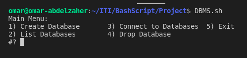
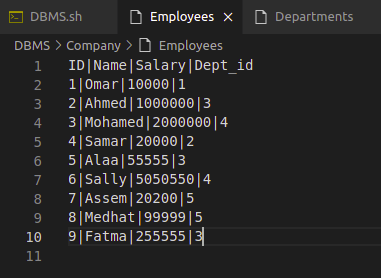
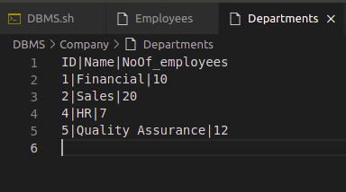
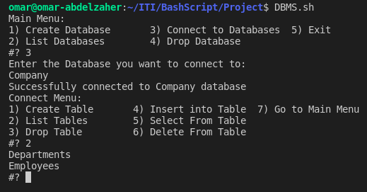
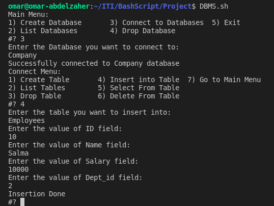
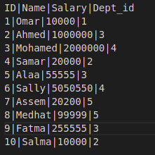
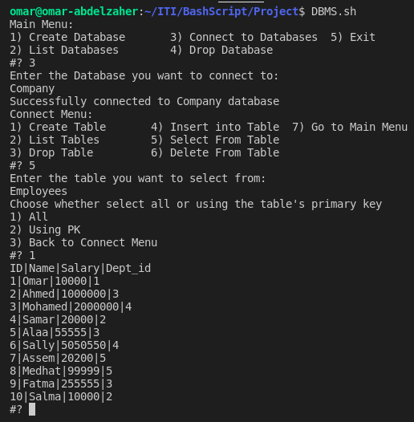
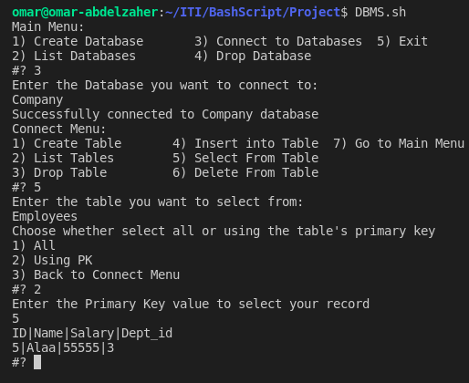
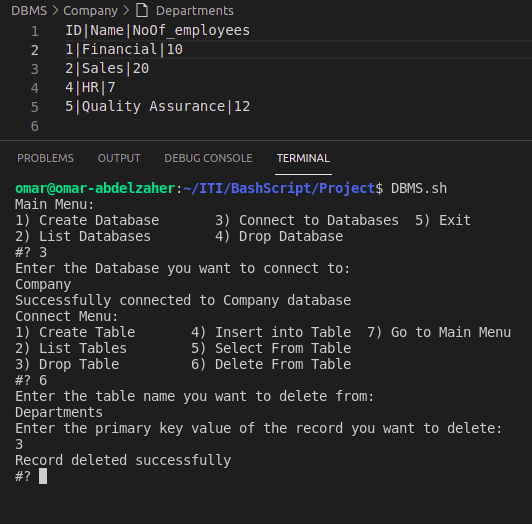

# Introduction
- This project is about implementing a DBMS (Database Management System) using `Bash Script` language

- It was a good practice to develop our skills in `Bash Script` and know more about its syntax, also know more about Linux commands

- To deal with tables structures we needed to use `AWK`, `sed`, and output redirection `>>`

- We presented some validation features like:

  1) Null Values

  2) If tables and databases exist

  3) Prevent creation of duplicate names for tables and databases

- Also the terminal shows friendly instructions to user to direct him to enter valid and proper inputs

- A Menu with flexible navigation forward and backward options is presented too

# Project Features
### - Create Database
### - List Databases      
### - Drop Database   
### - Connect to Database to:
- #### Create Table
- #### List Tables
- #### Drop Table
- #### Insert Into Table
- #### Select From Table
  - Select all from table
  - Select using primary key
- #### Delete From Table

# Screenshots of some Features Output:

## Main Menu

## Company Database Tables:

## Listing Tables:

## Insert Into Table:

## Select From Table:

  - ### Select All

  

  - ### Select One Record using Primary Key

  

## Delete From Table:

# This Work is Presented By:
- ## Reem Shkeep
- ## Omar Abdelzaher
